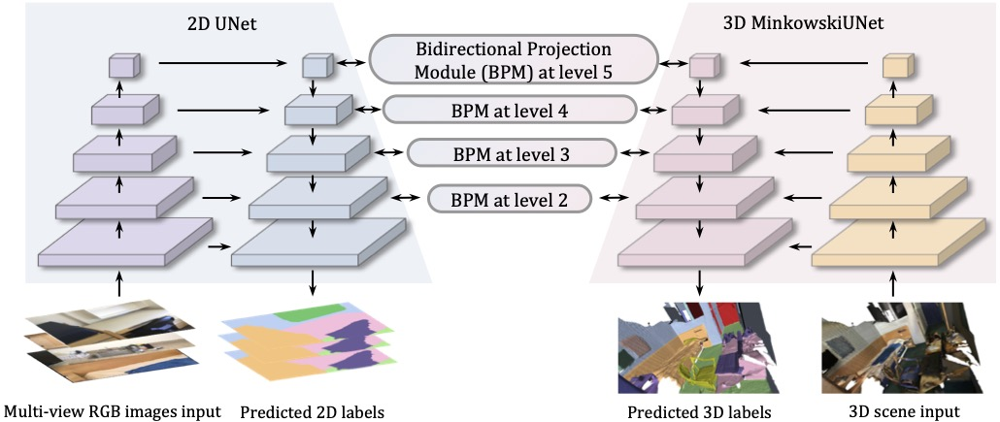

# Bidirectional Projection Network for Cross Dimension Scene Understanding

***CVPR 2021 (Oral)***

[ [Project Webpage](https://wbhu.github.io/projects/BPNet) ]    [ [arXiv](https://arxiv.org/abs/2103.14326) ]    [ [Video](https://youtu.be/Wt9J1l_UBaA) ]

Existing segmentation methods are mostly unidirectional, i.e. utilizing 3D for 2D segmentation or vice versa. Obviously 2D and 3D information can nicely complement each other in both directions, during the segmentation. This is the goal of bidirectional projection network.




## Environment


```bash
# Torch
$ pip install torch==1.4.0+cu100 torchvision==0.5.0+cu100 -f https://download.pytorch.org/whl/torch_stable.html
# MinkowskiEngine 0.4.1
$ conda install numpy openblas
$ git clone https://github.com/StanfordVL/MinkowskiEngine.git
$ cd MinkowskiEngine
$ git checkout f1a419cc5792562a06df9e1da686b7ce8f3bb5ad
$ python setup.py install
# Others
$ pip install imageio==2.8.0 opencv-python==4.2.0.32 pillow==7.0.0 pyyaml==5.3 scipy==1.4.1 sharedarray==3.2.0 tensorboardx==2.0 tqdm==4.42.1
```

## Prepare data
- 2D: The scripts is from 3DMV repo, it is based on python2, other code in this repo is based on python3
	```python prepare_2d_data.py --scannet_path data/scannetv2 --output_path data/scannetv2_images --export_label_images```
	
- 3D: dataset/preprocess_3d_scannet.py

## Usage

- Train: ```sh tool/train.sh EXP_NAME /PATH/TO/CONFIG NUMBER_OF_THREADS```
- Resume: ```sh tool/resume.sh EXP_NAME /PATH/TO/CONFIG(copied one) NUMBER_OF_THREADS```
- Test: ```sh tool/test.sh EXP_NAME /PATH/TO/CONFIG(copied one) NUMBER_OF_THREADS)```

NUMBER_OF_THREADS is the threads to use per process (gpu), so optimally, it should be **Total_threads / gpu_number_used**

## Config

- BPNet_5cm: config/scannet/bpnet.yaml 


## Still in cleaning process ... It will be finished before the conference.

